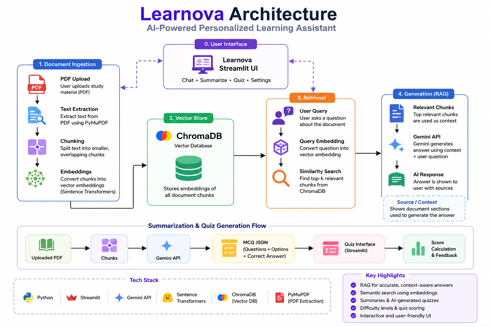

# 🎓 Learnova — AI-Powered Personalized Learning Assistant

Learnova is an AI-powered learning assistant that helps students understand study materials, ask questions from uploaded PDFs, generate summaries, and practice with automatically generated quizzes.

It combines **Generative AI, Retrieval-Augmented Generation (RAG), embeddings, and vector search** to provide answers grounded in the user's uploaded learning material.

---

## ✨ Features

- 💬 **AI Study Chat** — Ask questions about uploaded study material and receive context-grounded explanations using Gemini.
- 📄 **PDF Learning** — Upload lecture notes, textbooks, or study materials.
- 🔎 **RAG-Based Question Answering** — Retrieves relevant content from uploaded documents before generating answers.
- 🧠 **Semantic Search** — Uses embeddings to find the most relevant document sections.
- 🗃️ **Vector Storage** — Stores document embeddings using ChromaDB.
- 📚 **Automatic Summarization** — Generate concise and exam-focused summaries from uploaded documents.
- 📝 **AI Quiz Generation** — Automatically generate multiple-choice questions from study material.
- 🎯 **Difficulty Levels** — Choose Beginner, Intermediate, or Advanced explanations and quizzes.
- 📊 **Quiz Scoring** — Submit answers and receive an automatically calculated score with explanations.
- 📌 **Source Context** — View the document sections retrieved and used to generate RAG answers.
- 🎨 **Streamlit Interface** — Simple and interactive learning-focused UI.
- 🛡️ **Error Handling** — Handles temporary Gemini API service errors using retries and model fallback.

---

## 🛠️ Tech Stack

### Programming Language
- **Python**

### Frontend / User Interface
- **Streamlit**

### Generative AI
- **Google Gemini API**

### AI Architecture
- **Retrieval-Augmented Generation (RAG)**

### Embeddings
- **Sentence Transformers**
- Model: `all-MiniLM-L6-v2`

### Vector Database
- **ChromaDB**

### PDF Processing
- **PyMuPDF**

### Environment Management
- **python-dotenv**

---

## 🖥️ Application Screenshots

### 📄 PDF Upload & Document Processing


### 💬 AI Study Chat


### ❓ AI Quiz


> Add these screenshots to the `assets/` folder after capturing them from the working application.

---

## 🏗️ Architecture



---

## 🧠 How Learnova Works

Learnova uses a **Retrieval-Augmented Generation (RAG)** pipeline to generate answers grounded in the uploaded study material.

### 📄 Document Processing

```text
                    Uploaded PDF
                         │
                         ▼
                  Text Extraction
                    (PyMuPDF)
                         │
                         ▼
                     Chunking
                         │
                         ▼
                    Embeddings
              (Sentence Transformers)
                         │
                         ▼
                     ChromaDB
                   Vector Store
